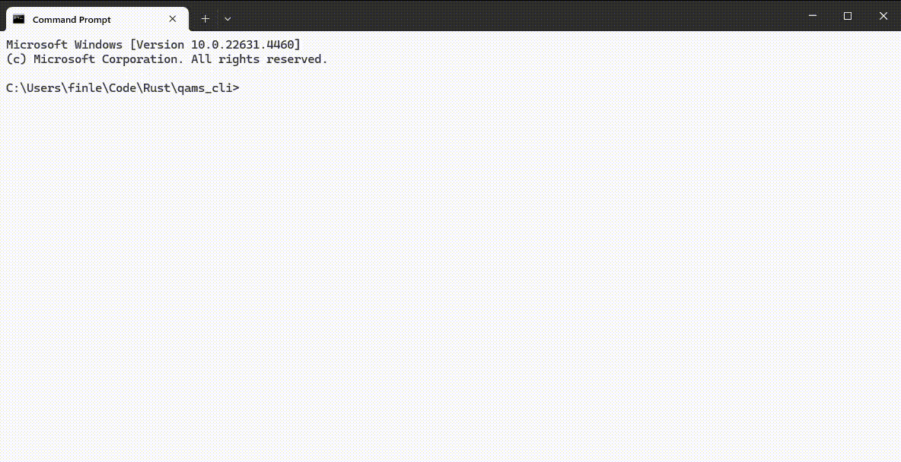

# qams_cli
QAMS (Quality Assurance Management System) is a purpose-built application for managing Quality Assurance reviews and scorecards. The CLI (Command Line Interface) version uses the [inquire](https://docs.rs/inquire/latest/inquire/) and [qams_core](https://github.com/falvamo/qams_core) packages to run QAMS in the command line. The CLI version is intended more as a proof of prototype for QAMS than a fully developed solution in itself. The fully developed version will implement a GUI (Graphical User Interface).

## Usage example
Check out the demo video:

This video is created using the [sample scorecard](./sample_scorecard.csv) provided, and the results are also provided in the [sample review](./sample_review.csv)